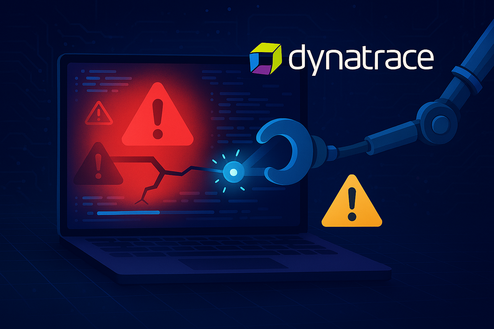

<!-- markdownlint-disable-next-line -->
#  Demo Dynatrace MCP Server with Unguard

___

## 🎯 Quick Summary

This hands-on tutorial demonstrates the power of the **Model Context Protocol (MCP)** combined with AI agents to analyze, detect, and remediate security vulnerabilities in real-world applications. Using the **Unguard** application—an intentionally vulnerable cloud-native microservices demo—you'll learn how to:

- **Connect to MCP Servers** and interact with AI-powered agents
- **Analyze vulnerable code** across 8 microservices (Java, .NET, Python, Node.js, PHP, Go, Next.js)
- **Query Dynatrace insights** to correlate code vulnerabilities with runtime security findings
- **Leverage Davis CoPilot** for intelligent security recommendations
- **Automatically remediate vulnerabilities** with AI-assisted code fixes
- **Access observability data** including logs, metrics, traces, and security events

### What's Inside?

- **Unguard Application**: 8 microservices with real vulnerabilities (SSRF, SQL Injection, RCE, JWT confusion, etc.)
- **MCP Integration**: Direct connection to Dynatrace monitoring and observability data
- **AI-Powered Analysis**: Automated vulnerability detection and remediation
- **Real-Time Insights**: Correlation between code issues and production runtime data

## [👨‍🏫 Learn how the Dynatrace MCP Server can help you be more efficient!](https://dynatrace-wwse.github.io/demo-mcp-unguard)

