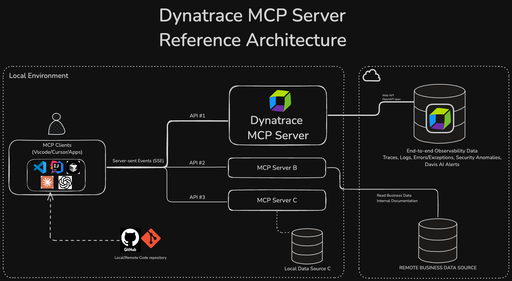

<!-- markdownlint-disable-next-line -->
#  Enablement MCP Demo

___

Ready to learn how to create an enablement using codespaces? 
## [👨‍🏫 Learn how the Dynatrace MCP Server can help you be more efficient!](https://dynatrace-wwse.github.io/enablement-mcp-demo)

